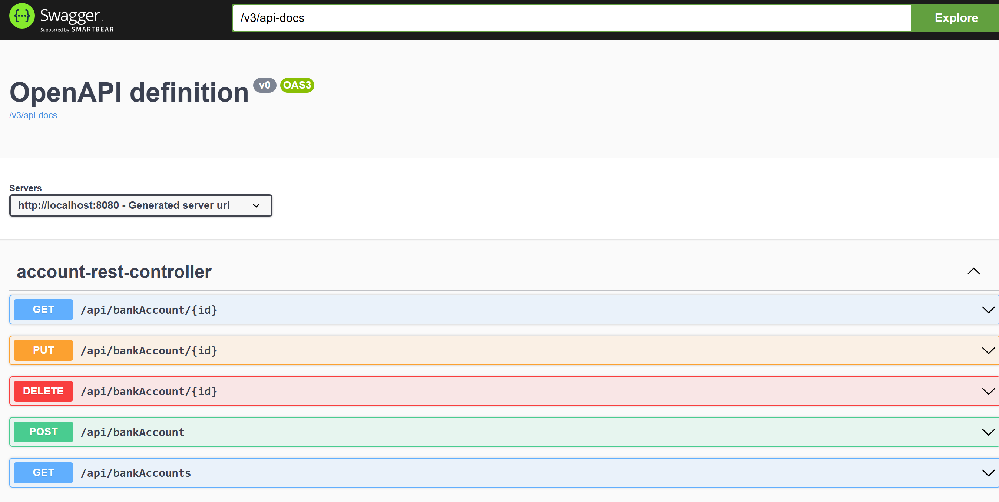
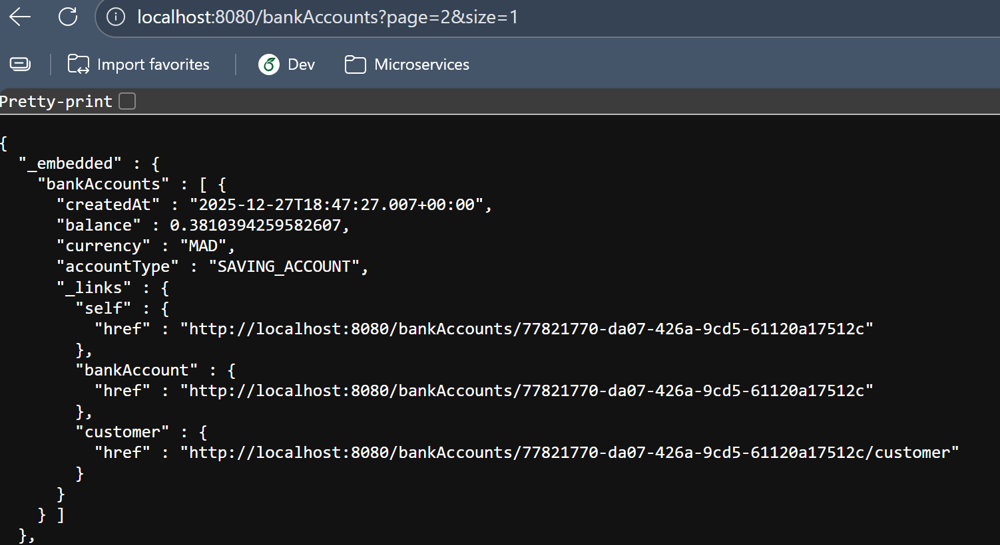
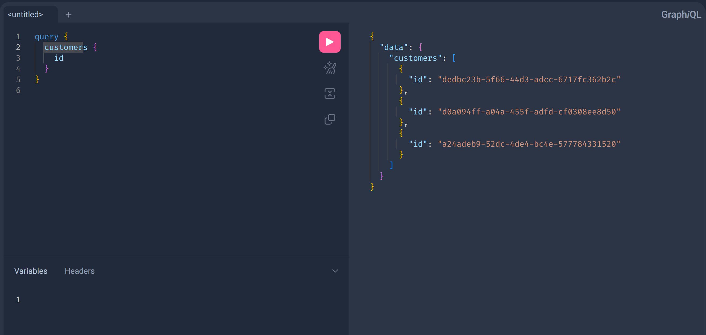
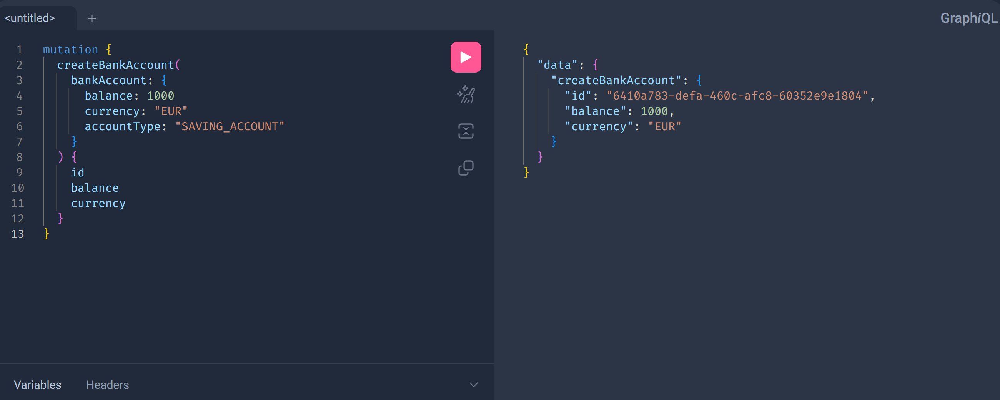

# Microservice Architecture – Spring Boot REST & GraphQL

## Description

This project is a **Spring Boot microservice** for managing **bank accounts** and **customers**.
It exposes:

* RESTful APIs
* Automatically generated REST APIs using Spring Data REST
* A GraphQL API
* Swagger (OpenAPI) documentation

The project demonstrates:

* JPA / Hibernate
* DTO and Mapper patterns
* Service (business) layer
* REST and GraphQL APIs
* Spring Data REST and projections

---

## Project Structure

```text
.
├── MicroserviceArchitectureApplication.java
├── controllers
│   ├── AccountGraphQLController.java
│   └── AccountRestController.java
├── dtos
│   ├── BankAccountDTO.java
│   ├── BankAccountRequestDTO.java
│   ├── BankAccountResponseDTO.java
│   ├── CustomerRequestDTO.java
│   └── CustomerResponseDTO.java
├── entities
│   ├── AccountProject.java
│   ├── BankAccount.java
│   └── Customer.java
├── enums
│   └── AccountType.java
├── mappers
│   ├── BankAccountMapperI.java
│   └── CustomerMapperI.java
├── repositories
│   ├── BankAccountRepository.java
│   └── CustomerRepository.java
└── services
    ├── BankAccountService.java
    ├── BankAccountServiceI.java
    ├── CustomerServiceI.java
    └── CustomerServiceImpl.jav
```

---

## Implemented Tasks

### JPA Entities

* `BankAccount`
* `Customer`

Relationship:

* One `Customer` can have multiple `BankAccount` entities.

---

### Repositories

Implemented using Spring Data JPA:

* `BankAccountRepository`
* `CustomerRepository`

---

### DAO Layer Testing

Tested using:

```java 
@Bean
    CommandLineRunner init(BankAccountRepository bankAccountRepository, CustomerRepository customerRepository) {
    
        return args -> {
            Stream.of("Aziz", "Mohammed", "Amina").forEach(name -> {
                Customer customer = Customer.builder().id(UUID.randomUUID().toString()).name(name).build();
                customerRepository.save(customer);
                for (int i = 0; i<5; i++){
                    BankAccount bankAccount = BankAccount.builder().id(UUID.randomUUID().toString()).accountType(Math.random()>0.5?
                            AccountType.CURRENT_ACCOUNT:AccountType.SAVING_ACCOUNT).createdAt(new Date()).customer(customer).balance(Math.random()).currency("MAD").build();
                    bankAccountRepository.save(bankAccount);
                }
            });
        };
    }
```

---

### RESTful Web Services

REST controller:

* `AccountRestController`

Features:

* CRUD operations for bank accounts

---

### Swagger Documentation

Swagger UI:



---

### REST API Using Spring Data REST and Projections

Repositories are automatically exposed using:

* Spring Data REST



* Projections to customize responses

```java
@Projection(types = {BankAccount.class}, name = "p1")
public interface AccountProject {
    public String getId();
    public AccountType getAccountType();
    public Double getBalance();
}
```


---

### Service (Business) Layer

Services:

* `BankAccountService`
* `CustomerService`

---

### GraphQL Web Service

#### GraphQL Endpoint

```
POST /graphiql
```

#### GraphQL Schema

```graphql
type Query {
  accountsList: [BankAccountResponseDTO]
  bankAccountById(id: String): BankAccountResponseDTO
  customerById(id: String): CustomerResponseDTO
  customers: [CustomerResponseDTO]
}

type Mutation {
  createBankAccount(bankAccount: BankAccountRequestDTO): BankAccountResponseDTO
  updateBankAccount(id: String, bankAccount: BankAccountRequestDTO): BankAccountResponseDTO
  deleteBankAccount(id: String): Boolean!
  createCustomer(customer: CustomerRequestDTO): CustomerResponseDTO
}

input CustomerRequestDTO {
  name: String
}

type CustomerResponseDTO {
  id: String
  name: String
  accounts: [BankAccountResponseDTO]
}

type BankAccountResponseDTO {
  id: String
  createdAt: Float
  balance: Float
  currency: String
  accountType: String
  customer: CustomerResponseDTO
}

input BankAccountRequestDTO {
  balance: Float
  currency: String
  accountType: String
}
```

### GraphQL Query Example

```graphql
query {
  customers {
    id
  }
}

```



---

### GraphQL Mutation Example

```graphql
mutation {
  createBankAccount(
    bankAccount: {
      balance: 1000
      currency: "EUR"
      accountType: "SAVING_ACCOUNT"
    }
  ) {
    id
    balance
    currency
  }
}
```




